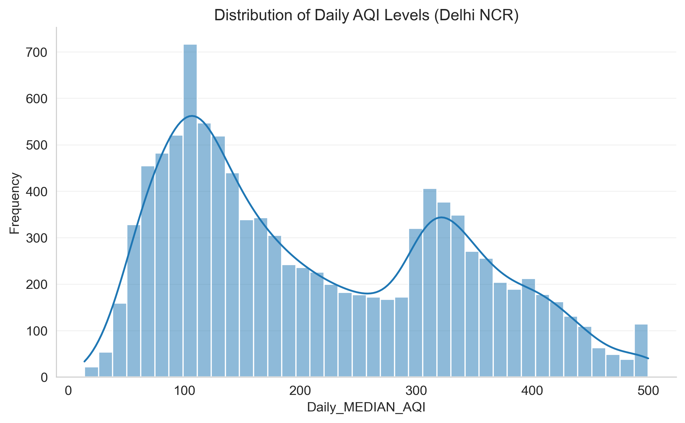
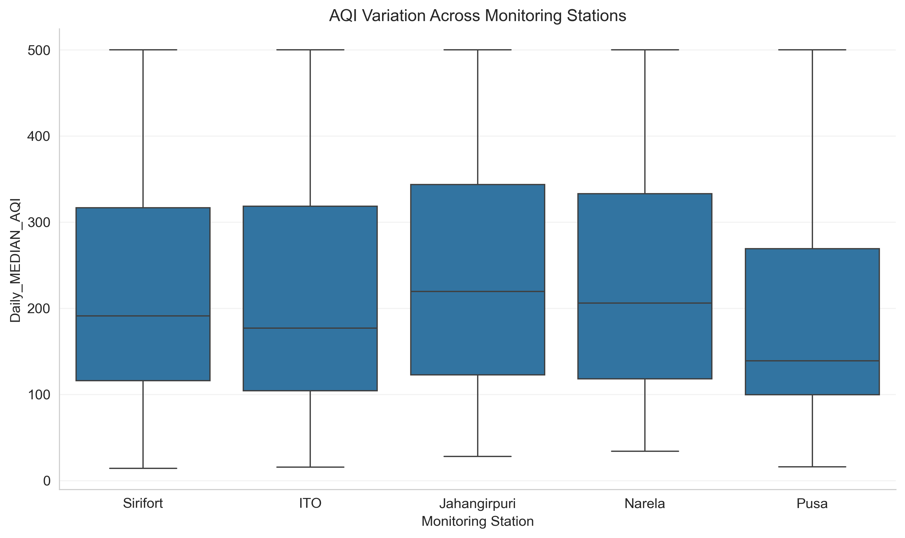
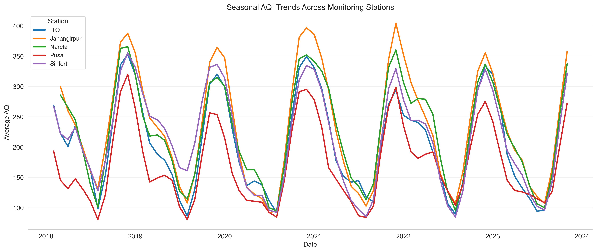
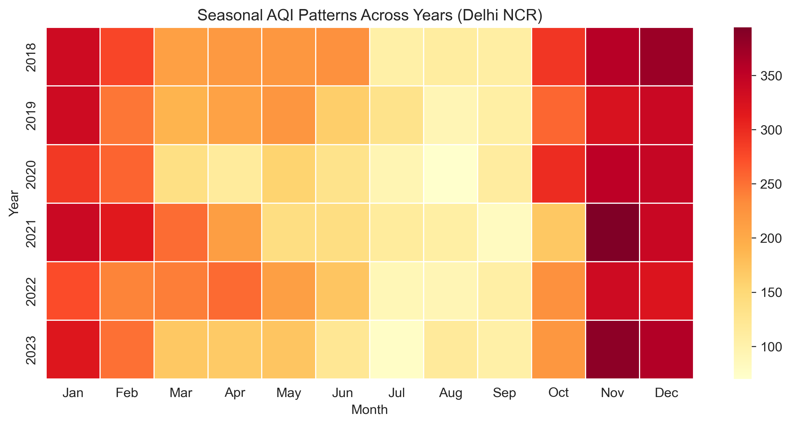
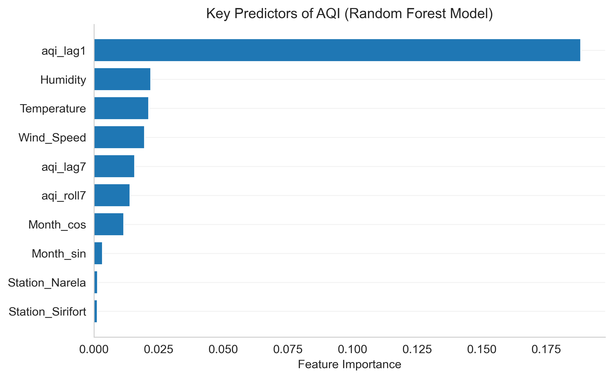
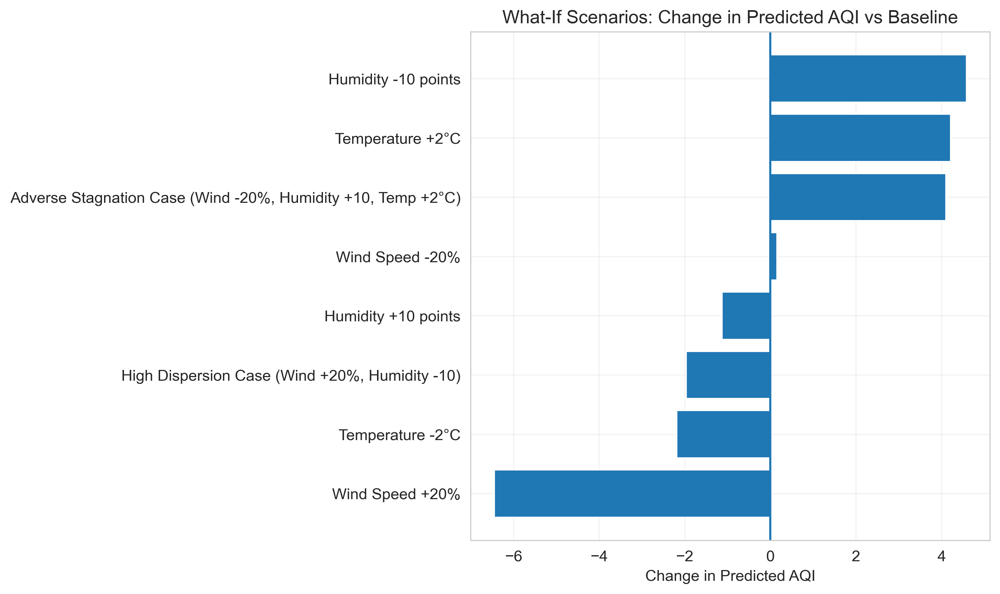
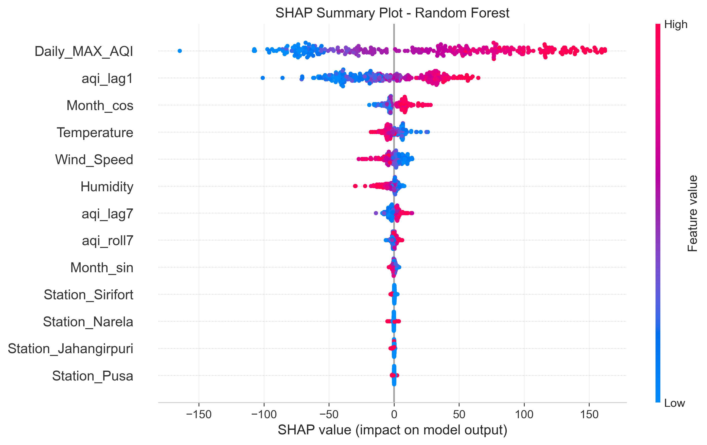

# Analysis and Prediction of Air Quality in Delhi–NCR (2018–2023)

## Project Overview
This project analyzes daily AQI levels across five CPCB monitoring stations in Delhi–NCR from 2018 to 2023. The study applies statistical testing and machine learning methods to:

- Examine seasonal variation
- Evaluate spatial heterogeneity
- Assess COVID-19 structural impact
- Develop predictive AQI models

## Dataset

- **Source:** Central Pollution Control Board (CPCB)
- **Study Period:** 2018–2023
- **Total Observations:** 10,924
- **Target Variable:** Daily Maximum Air Quality Index (Daily_MAX_AQI)

The dataset contains daily AQI observations from five monitoring stations in Delhi–NCR:

- ITO
- Jahangirpuri
- Narela
- Pusa
- Sirifort

Meteorological variables integrated into the dataset include:

- Temperature
- Humidity
- Wind Speed

---

## Methodology

The analytical framework combines statistical inference with machine learning techniques.

1. **Data Cleaning and Preprocessing**
2. **Exploratory Data Analysis (EDA)**
3. **Statistical Hypothesis Testing**
   - One-way ANOVA (seasonal variation)
   - Independent samples t-test (COVID-19 impact)
4. **Machine Learning Modeling**
   - Random Forest Regression
   - Gradient Boosting Regression
5. **Baseline Time-Series Model**
   - SARIMA
6. **Model Explainability**
   - SHAP (SHapley Additive Explanations)
7. **Scenario Analysis**
   - Evaluation of AQI changes under varying meteorological conditions

---

## Model Performance

| Model | RMSE |
|------|------|
| Random Forest (Weather Features) | **44.92** |
| Gradient Boosting | 45.86 |
| Random Forest (Without Weather) | 58.85 |
| SARIMA | 121.24 |

The Random Forest model incorporating meteorological variables achieved the best predictive performance.

---

## Repository Structure

```
dba-aqi-delhi-ncr
│
├── aqi_analysis_delhi_ncr.ipynb      # Main analysis notebook
├── aqi_delhi_ncr_2018_2023.csv       # AQI dataset
│
├── figures/                          # Visualizations generated by the analysis
│   ├── figure_1_aqi_distribution.png
│   ├── figure_2_station_distribution.png
│   ├── figure_3_seasonal_station_trends.png
│   ├── figure_4_seasonal_patterns_across_years.png
│   ├── figure_5_architecture_workflow.png
│   ├── figure_6_feature_importance.png
│   ├── figure_7_scenario_analysis.png
│   └── figure_8_shap_summary.png
│
├── requirements.txt                  # Python dependencies
└── README.md                         # Project documentation
```

---


## Author
Brijesh Kumar  
Doctorate in Business Administration (ML & AI)

## Project Visualizations

### AQI Distribution


### Station-wise AQI Distribution


### Seasonal Trends Across Stations


### Seasonal Patterns Across Years


### Feature Importance


### Scenario Analysis


### SHAP Explainability



